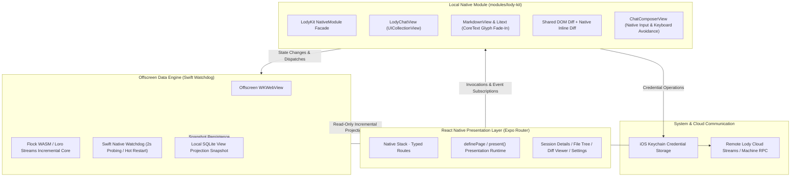

<div align="center">
  
  <h1>Lody iOS</h1>
  <p><b>Independent iOS Native Client</b> · AI Collaboration & Session Companion for Mobile</p>

  <p>
    
    
    
    
    
    
  </p>
</div>


---

> [!IMPORTANT]
> **This is a third-party project.** Lody iOS is an independent, community-maintained client. It is not affiliated with, endorsed by, or supported by the official Lody team. Report issues in this repository, not upstream.
>
> **The project is still under development.** It iterates quickly, so APIs, sync behavior, and UI may change without notice, and builds can be unstable or break existing sessions. Evaluate the risk yourself before relying on it.

> [!IMPORTANT]
> **本项目为第三方项目。** Lody iOS 由社区独立维护，与 Lody 官方团队无关，也不代表官方立场；本项目的问题请在本仓库反馈，不要提交给上游。
>
> **项目仍在开发中。** 迭代速度较快，接口、同步行为与界面可能随时调整，版本可能不稳定甚至破坏已有会话数据，请在评估风险后使用。

---

## Overview

**Lody iOS** is an independent open-source client crafted for iPhone, providing a lightweight and secure bridge between remote Lody services and local workspaces.

The project uses a hybrid architecture of **React Native + a deeply customized Swift native module (LodyKit)**. While preserving the rapid iteration advantages of declarative cross-platform UI, critical interactions (infinite chat collection, streaming text rendering, code diff highlighting, file tree, etc.) are built with native Swift and CoreText to deliver an authentic iOS system feel.

---

## Features

### Authentic Apple HIG Native Experience

- **Human Interface Guidelines Compliance**: Native adoption of iOS semantic colors, automatic light and dark mode adaptation, and Dynamic Type with SF Pro and SF Mono.
- **Native Navigation**: A single Expo Router native Stack with typed routes, transparent headers, and soft scroll edge effects. Transient flows open as native sheets through the shared `present()` runtime, and system grouped rows use UIKit `UICollectionViewListCell` via `LodyGroupedList`.
- **Bilingual by Default**: English and Simplified Chinese product copy lives in `apps/mobile/locales`, is checked in CI, and is projected into native `xcstrings` catalogs by the local `withLocales` config plugin.

### High-Performance Native Streaming Chat

- **Virtualized Chat Collection**: The chat view is backed by native Swift `UICollectionView`, maintaining full 60/120 fps smoothness even with extensive message histories.
- **CoreText Markdown Rendering**: Deeply integrated with [MarkdownView](https://github.com/Lakr233/MarkdownView) and [Litext](https://github.com/Lakr233/Litext), natively supporting complex tables, syntax-highlighted code blocks, task lists, LaTeX math formulas, and system text selection handles.
- **Smooth Character Fade-In**: Balanced batch scheduling paired with low-level `CTRunDraw` character alpha transitions delivers gentle, flicker-free streaming output during AI generation.
- **Native Input (`ChatComposerView`)**: Pixel-perfect keyboard avoidance matching system input methods, local draft persistence with automatic restoration, and real-time model thinking effort controls.

### Code Diffs & Workspace File Browsing

- **Turn Changes Overview**: Automatically summarizes file changes for each conversation turn, with one-tap access to all modified files.
- **Word-Level Diff Highlighting**: Full-screen diffs reuse a prewarmed Expo DOM WebView running [@pierre/diffs](https://github.com/pierrecomputer/pierre/tree/main/packages/diffs). Tool-detail diffs render natively in LodyKit.
- **Remote Workspace File Tree**: Browse project directories and files on remote Macs or servers at any time, with previews via native code view `LodyCodeView` or system Quick Look.

### Offscreen WASM CRDT Data Sync Engine

- **Seamless CRDT Collaboration**: Executes official Loro / Flock CRDT incremental sync cores and Streams clients in a Swift-managed offscreen `WKWebView`, completely avoiding Node/CRDT/Zstd dependency bundling issues in React Native.
- **Watchdog Protection**: Native Swift probing keeps background execution resilient, supporting graceful hot recovery if an anomaly occurs.
- **Multi-Session Background Sync**: Local SQLite display projections ensure millisecond cold starts, while background synchronization maintains real-time bi-directional updates for active sessions.

### Security First & Hardware Isolation

- **Standard Device Flow Auth**: Authorizes via the official Better Auth Device Flow.
- **System Keychain Storage**: All authentication credentials and sensitive communication keys are strictly isolated in the iOS Keychain and never exposed in app-accessible shared storage.

---

## Architecture



---

## Directory Structure

```text
lody-ios/
├── apps/
│   └── mobile/
│       ├── src/
│       │   ├── app/                 # Expo Router routes (typed routes) and the Stack declaration
│       │   ├── screens/             # *Screen pages defined with definePage
│       │   ├── features/            # Domain logic (sessions, diff, licenses)
│       │   ├── cloud/               # Cloud protocol (auth, catalog, send, kv, settings)
│       │   ├── models/              # Shared data shapes
│       │   ├── ui/                  # Shared React Native base components
│       │   ├── hooks/               # Screen bindings (session nav, page runtime, process sheet)
│       │   └── lib/                 # Infrastructure (presentation, i18n, theme)
│       ├── modules/
│       │   └── lody-kit/            # First-party local native Swift module (LodyKit)
│       │       ├── ios/             # Swift / UIKit / CoreText native code
│       │       ├── data-runtime/    # Offscreen data runtime RPC and adapter scripts
│       │       ├── decoder/         # Flock decoder bundled into the offscreen WebView
│       │       ├── src/             # Typed native component interfaces for React Native
│       │       └── verification/    # Deterministic Swift behavior checks
│       ├── verification/            # Offline UI/native baselines and Simulator tooling
│       ├── tests/                   # Node test-runner suites
│       ├── locales/                 # en / zh-Hans catalogs (projected into xcstrings)
│       ├── plugins/                 # Local Expo config plugins (MarkdownView, locales)
│       ├── scripts/                 # native:assets, license generation, locale checks
│       └── package.json
├── packages/
│   └── dom-webview/                 # Vendored Expo DOM WebView (MIT) hosting the shared diff view
├── docs/                            # Architecture design, specs, and evolution docs
├── package.json                     # Monorepo root configuration
└── pnpm-workspace.yaml
```

---

## Development & Build

### Prerequisites

- **macOS**: Sequoia or later (CI builds on macOS 26)
- **Xcode**: 26.5 with Command Line Tools — the toolchain CI pins and the offline Simulator baselines require
- **Node.js**: `>= 22.13` (React Native 0.86 also accepts `^20.19.4`, `^24.3`, and `>= 25`)
- **pnpm**: `11.10.0` (`corepack enable`)
- **Ruby & Bundler**: `apps/mobile/Gemfile` pins `cocoapods ~> 1.16` and `cocoapods-spm`

### Getting Started

1. **Clone the repository and install JavaScript dependencies**:

   ```sh
   git clone https://github.com/Innei/lody-ios.git
   cd lody-ios
   pnpm install
   ```

2. **Install the CocoaPods toolchain** (into `apps/mobile/vendor/bundle`):

   ```sh
   cd apps/mobile
   bundle install
   cd ../..
   ```

3. **Generate the native project and launch simulator**:

   ```sh
   pnpm ios
   ```

   > [!TIP]
   > This project uses `cocoapods-spm` to integrate SPM static library dependencies. `pnpm ios` runs `native:assets`, generates the native project, and executes `bundle exec pod install` to fetch dependencies and link symbols.
   > After building native code once, run `pnpm start` directly when modifying only JavaScript to connect to the hot reload server.

4. **Update native assets**:

   If you modify runtime assets in `modules/lody-kit/data-runtime/` or `modules/lody-kit/decoder/`, run:

   ```sh
   pnpm --filter @lody-ios/mobile native:assets
   ```

### Quality Checks & Testing

```sh
pnpm check            # TypeScript, locale catalogs, generated license notices, Prettier
pnpm test             # Node test suites, Simulator tooling tests, vendored DOM WebView tests
pnpm bundle           # Verify iOS Hermes JavaScript production bundle integrity
pnpm licenses:build   # Regenerate the in-app notices after dependency changes
```

### Offline UI Verification

UI baselines run without login, user credentials, cloud access, or a connected machine: `EXPO_PUBLIC_UI_VERIFY=1` injects deterministic data at the Auth/Catalog boundary, and every case starts from the development-only Debug page.

```sh
pnpm verify:simulator --name '<current verify>' -- <command>   # Lease a Lody * Verify Simulator
pnpm verify:native                                             # Swift behavior checks
pnpm verify:ui --app /absolute/path/to/Lody.app                # Offline UI baselines
```

The runner captures screenshots for visual states and video for temporal behavior; missing scenes and timeouts fail the run. See [`apps/mobile/verification/ui/README.md`](apps/mobile/verification/ui/README.md) for the case inventory and Simulator leasing rules.

### Releases

Pushing to `main` runs `.github/workflows/ship.yml`. A push always archives a TestFlight build through `.github/workflows/release.yml`; a manual dispatch publishes an OTA update to the configured `expo-updates` server when the Expo fingerprint matches the published baseline, and falls back to TestFlight when it changes. Native runtime assets are regenerated before either route.

---

## License

Lody iOS is released under the [GNU Affero General Public License v3.0](LICENSE) (**AGPL-3.0-only**). You may use, modify, and distribute it, including commercially, provided that derivative works and network-served modifications stay under the same license and their source stays available to users.

Bundled third-party libraries and assets keep their own licenses. The full list and license texts are available in the app under **Settings → Open Source Licenses**. The notices are generated from the production dependency closure by `pnpm licenses:build` and verified in CI by `pnpm check`.

---

## Acknowledgements

Lody iOS is made possible thanks to these open-source projects and creators:

- **[FlowDown](https://github.com/Lakr233/FlowDown)**: Thanks to [Lakr233](https://github.com/Lakr233) and contributors. Lody's native message collection view, stream batching mechanism, and dynamic measurement cache architecture drew significant inspiration from FlowDown.
- **[unixzii](https://github.com/unixzii)**: Original author of Litext, the CoreText rich-text engine underneath MarkdownView and Lody's native chat rendering. Also a generous teacher — a great deal of this project's iOS knowledge came from him.
- **[MarkdownView](https://github.com/Lakr233/MarkdownView) & [Litext](https://github.com/Lakr233/Litext)**: High-performance, extensible CoreText Markdown rendering and typography for iOS.
- **[@pierre/diffs](https://github.com/pierrecomputer/pierre/tree/main/packages/diffs)**: Word-level diff algorithms and the full-screen DOM viewer.
- **[Loro](https://github.com/loro-dev/loro)**: High-performance, production-grade next-generation CRDT state synchronization.
- **[Expo DOM WebView](https://github.com/expo/expo/tree/main/packages/%40expo/dom-webview)**: Vendored under `packages/dom-webview` (MIT) and extended to host the shared diff view.
- **[AXe](https://github.com/cameroncooke/AXe)**: Simulator UI automation driving the offline UI baselines.
