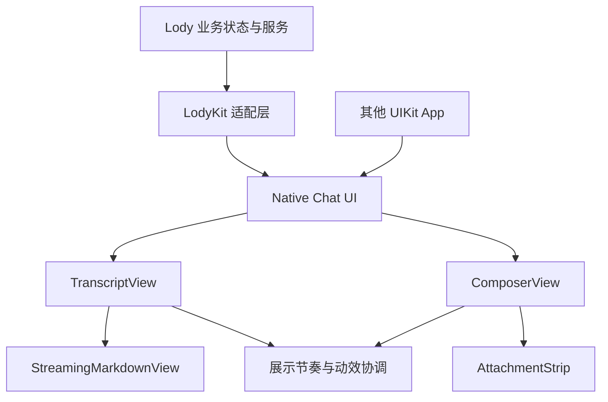

# Native Chat UI 可复用库设计草案

状态：分阶段实施中。已确认产品方向为通用 Swift Package，支持下游样式定制。以下目标结构包含尚未实现的后续阶段；当前范围见文末迁移记录。

## 目标与边界

将现有原生聊天体验整理为通过 Swift Package Manager 分发的通用 iOS UIKit UI 库，供后续 App 和外部下游复用。范围包括 UICollectionView 消息列表、Markdown 渲染、流式动效、输入 Composer 和附件 Pill。库接受展示模型并产生交互事件；账号、模型请求、上传、持久化、重试策略和业务导航由宿主负责。通用性指业务与品牌独立，当前范围仍为 iOS。

第一阶段在 LodyKit 内建立边界，继续通过 LodyKitModule 注册原生能力，不新增桥接包。独立发布阶段才将无业务依赖的 Swift 源码移入独立包；LodyKit 保留适配入口。本文使用的类型名均为候选名称。

## 当前实现与耦合

`apps/mobile/modules/lody-kit/ios/Chat` 下当前顶层 Swift 文件合计 12,686 行，包含产品功能和调试实现，并非全部属于待抽取核心。

| 能力       | 当前主要文件                                                                  | 整理方向                                                                       |
| ---------- | ----------------------------------------------------------------------------- | ------------------------------------------------------------------------------ |
| 列表与布局 | `LodyChatView.swift`、`+Transcript.swift`、`+Scroll.swift`                    | 分开 UIKit 容器、展示更新、滚动协调和 Expo 事件桥接                            |
| Markdown   | `ChatMarkdownView.swift`、`ChatMarkdownStore.swift`、`FileMarkdownView.swift` | 保留 block 复用、测量缓存和代码/表格交互；抽离文件业务动作、验证探针和资源定位 |
| 流式展示   | `ChatStream.swift`、`ChatFadeLabelView.swift`、`ChatTextFade.swift`           | 将文本节奏、淡入、布局收敛作为相互协调的内部机制                               |
| 发送动画   | `ChatSendHandoff.swift`、`ChatThrowCurve.swift`、`LodyComposerView.swift`     | 将静态共享状态改为显式注入的交接作用域，支持多个聊天实例                       |
| 输入       | `ChatComposerView.swift`、`ChatComposerModelPanel.swift`                      | 分开文本/草稿/附件交互与模型、队列、steer、连接状态适配                        |
| 附件       | `ChatAttachments.swift`、`ChatMessageAttachmentsCell.swift`                   | 分开模型、导入、缩略图、Pill、预览和发送交接                                   |
| 消息投影   | `ChatTranscript.swift`                                                        | 将 execution、delivery、steer 和存储字段转换移入 Lody 适配层                   |

具体约束：

- `LodyChatView` 通过 Expo 的 EventDispatcher 直接导出大量业务事件，并持有导航、渲染、滚动和发送状态。
- `ChatStream` 的文本推进本身接近纯逻辑，但其输入仍为包含 Lody 执行语义的 `ChatEntry`。
- `ChatImageCell` 直接通过 `SessionAttachments` 构造服务 URL，不能原样作为公共媒体组件。
- `ChatSendHandoff` 有静态 active 集合与 onSettled 回调；跨 Composer/页面交接需要明确所有者及取消清理。
- `ChatAttachmentBar` 依赖 `LodyGlassView`、`LodyStrings`；这些依赖应转成库自己的材质实现与可配置文案，不能把整个 Lody 基础设施迁入。
- `FileMarkdownView` 同时包含验证行为，并通过 `LodyKitModule` 定位资源，需要独立的资源入口。

## 目标结构



起步使用一个 Swift 包、少量公开组件，内部按 Transcript / Markdown / Composer / Attachments / Motion 分目录。暂不拆成多个版本独立的库。SwiftUI 包装可以后续补充，不作为第一阶段前置条件。

包结构以以下形式为目标，最终包名待定：

```text
Package.swift
Sources/ChatKit/
  Models/
  Styling/
  Transcript/
  Markdown/
  Composer/
  Attachments/
  Motion/
  Resources/
Tests/ChatKitTests/
Examples/UIKitChatDemo/
```

提供一个 library product；列表、Markdown、Composer 和附件条均可独立实例化，也可通过组合容器使用。包内资源通过自身 bundle 定位，不依赖 LodyKit 或主 App 的资源名称。示例 App 消费同一包。Expo 适配代码保留在 Lody 仓库，不进入 Swift Package 的依赖图。

当前 LodyKit 声明 iOS 26.0、Swift 6.0；先以此为提案基线，不承诺更低系统版本。MarkdownView 与 MarkdownParser 保留现有依赖，单独确认其包集成、资源和许可证清单。

## 公共接口原则

| 接口                          | 核心职责                                          | 宿主职责                                         |
| ----------------------------- | ------------------------------------------------- | ------------------------------------------------ |
| `ChatMessage` / `ChatContent` | 稳定消息及内容 ID、展示顺序、文本、媒体、展示状态 | 将自己的后端协议投影为展示模型                   |
| `TranscriptView`              | 更新、复用、测量、历史插入锚点、底部跟随          | 提供完整文本版本和历史数据；处理链接、重试等事件 |
| `ComposerView`                | 编辑、IME、草稿内容、附件、发送意图、键盘布局     | 接受/拒绝发送、业务队列、草稿持久化              |
| `AttachmentStrip`             | 缩略图、文件名、删除、预览意图、状态呈现          | 导入来源、上传进度与失败重试、文件生命周期       |
| `MediaProvider`               | 可取消的媒体获取接口                              | URL、认证、缓存、下载及失效策略                  |
| `ChatInteractionScope`        | 同一发送链路的源/目标匹配、动画清理               | 显式共享给新会话 Composer 与目标聊天页           |

公共 API 使用类型化 Swift 值与 delegate/closure；JSON 编解码停留在 Expo 适配层。自定义内容先提供一个受控扩展点，包括稳定 ID、配置、测量和动作回调，不提前设计插件体系。

模型/推理强度选择器属于可选 Composer 配置，选项由宿主提供。steer、机器连接、仓库 Mention、工具权限等业务行为留在 Lody 适配层；核心仅提供相应展示或动作扩展位置。

## 下游样式定制

样式定制是首版公共 API 的组成部分。默认主题遵循 UIKit 语义颜色、字体与材质，不携带 Lody 品牌。Lody 自身通过与其他下游相同的公开接口应用外观，避免保留仅供 Lody 使用的内部定制入口。

采用三层定制，优先使用前两层：

| 层级       | 候选接口                                                            | 可定制内容                                                                                    |
| ---------- | ------------------------------------------------------------------- | --------------------------------------------------------------------------------------------- |
| 全局主题   | `ChatTheme`                                                         | tint、背景、正文/次要文字、字体与基础间距                                                     |
| 组件样式   | `MessageStyle`、`MarkdownStyle`、`ComposerStyle`、`AttachmentStyle` | 消息背景与圆角、角色差异、内容边距、代码/引用/表格样式、输入框材质与按钮图标、Pill 尺寸和颜色 |
| 自定义内容 | 受控 renderer/accessory 接口                                        | 业务消息块、Composer 附加操作区、需要自定义布局的内容                                         |

第一版允许用户/助手等角色分别配置外观；需要按消息变化时，由样式 resolver 接受稳定消息标识、角色和展示状态，返回样式值。普通颜色与间距修改不要求实现 renderer，也不要求继承内部 Cell 或访问 UICollectionView 的 dataSource。

主题与组件样式使用值类型，并提供完整的系统默认值。每个聊天实例单独持有配置，无全局可变主题或 UIAppearance 副作用。覆盖优先级为：消息级样式覆盖 → 组件配置 → 主题默认值。可单独使用的组件同样接受这些样式类型。

示意 API（非已实现接口）：

```swift
var theme = ChatTheme.system
theme.tintColor = .systemIndigo

var style = ChatStyle(theme: theme)
style.messages.user.cornerRadius = 18
style.messages.user.backgroundColor = .secondarySystemBackground
style.composer.surface = .material
style.attachments.cornerRadius = 12

let chat = ChatView(style: style)
```

样式更新必须具有明确行为：

- 主线程应用新样式；不重建聊天实例，不清空草稿，不重播已完成的动画。
- 颜色变化重新绘制；字体、内边距和尺寸变化使相关 Markdown/行高缓存失效，并保留阅读锚点。
- 支持 UIKit 动态颜色和系统字体变化；主题变更传递到代码、表格、附件与 Composer，不能只更新顶层背景。
- 自定义内容负责自身配置、尺寸、复用清理和可访问性，包继续拥有列表复用调度、滚动和动画生命周期。异步尺寸变化通过显式回调使布局失效。
- 内置控件在视觉尺寸调整时保留至少 44 pt 操作区域。宿主自定义 renderer 的交互与可访问性责任写入接口文档。

动效策略与外观分开配置，例如 `ChatMotionConfiguration` 控制是否展示流式渐显、发送过渡及有限的节奏参数；底部跟随规则属于行为配置。内部计时器、缓存和布局算法不作为样式接口公开。Reduce Motion 优先于普通动效配置。

首版不开放任意替换布局引擎或对内部 UIView 树进行修改的接口；新增样式项以明确下游用例驱动。库 API 不直接暴露第三方 MarkdownView 的主题类型，由内部适配转换，避免下游与具体渲染依赖绑定。

## 必须保留的交互语义

- 权威文本与动画展示文本分开保存；服务端修订能替换旧文本，动画不能改变原始内容。
- 明确生成中、停止、完成、失败的展示状态。完成时等待可见尾部收敛，再执行折叠等布局动作；网络 ACK 不等于生成完成。
- 用户向上浏览时暂停底部跟随；回到底部后恢复。历史插入、键盘变化和流式高度更新保持阅读锚点。
- 已完成 Markdown block 复用视图与测量结果；支持未闭合语法、表格横向滚动和代码交互。
- 一次发送用稳定 ID 关联草稿、附件、动画和最终消息。发送失败恢复原草稿，不覆盖发送后新输入的内容。
- 同一交接作用域支持 sheet 到聊天页转换；不同会话/窗口互不接收发送或动画回调。卸载、取消和后台切换释放计时器与临时状态。
- 附件独立建模，不嵌入输入文本。Pill 与消息附件共享稳定标识，区分本地可预览资源与远端资源；宿主明确临时文件何时可删除。
- 保留原生导航、软滚动边缘、窗口坐标下的键盘处理、VoiceOver、44 pt 操作目标和 Reduce Motion 行为。

## 渐进实施与完成标准

1. **固定现有行为基线。** 使用现有离线 Debug 场景记录流式、Markdown、发送、附件和 Composer 两个宿主的基线；静态检查结果不能代替视觉验收。
2. **在 LodyKit 内解耦。** 引入展示模型映射、媒体接口和实例化交接作用域；拆开 Composer 与附件文件的职责。保持现有 React Native API，避免将调用方迁移与内部重构混在一起。
3. **验证完整交互链路。** 让列表、Markdown、Composer 与附件通过新边界协同；每个切片回归后再继续。先保持行为等价，再逐项改善 UX。
4. **建立独立消费验证。** 将核心移入 Swift 包，添加无需 Expo、账号、联网或 Lody 服务的 UIKit 示例 App。LodyKit 消费同一份源码，验证资源与依赖独立安装。示例同时提供系统默认主题和明显不同的自定义主题，验证下游无需修改库源码即可定制四类组件。
5. **准备公开发布。** 文档、最小接入示例、定制方式、系统兼容范围、性能样例与第三方声明齐全后发布。现有 podspec 声明 AGPL-3.0-only；独立库许可证另行明确，不在重构中自动修改。

第一批建议完成“展示模型映射 + MediaProvider + ChatInteractionScope”，它们决定后续组件能否真正脱离 Lody；单纯移动文件不算完成抽取。

## 验证要求

优先复用现有 `apps/mobile/verification/ui` 下的 `markdown.py`、`chat-stream-performance.py`、`smooth-scroll.py`、`composer.py`、`composer-relay.py`、`send-handoff.py`、`send-transition.py` 和相关附件场景。具体场景覆盖需在实施时核对，不能仅凭脚本名称认定已经覆盖。

新增行为覆盖重点：两个聊天实例互不干扰；流中修订文本；停止/失败时尾部正确收敛；上翻期间持续收流；历史插入保持锚点；发送失败后新输入与旧草稿并存；附件单独发送与删除；sheet 到聊天页交接取消。

样式覆盖重点：两个实例使用不同主题互不影响；流式生成及草稿编辑期间切换主题不丢状态；字体/间距变化后行高与阅读锚点正确；浅色/深色下代码、表格、Composer 和附件一致更新；自定义消息块复用后无旧内容残留；独立 Composer 与聊天内 Composer 应用同一配置。验证真实行为，不为默认样式常量表编写快照测试。

按仓库要求运行 `pnpm check`、`pnpm bundle`、有签名的 Simulator build。新增/删除 Swift 文件后运行 pods；通过 `pnpm verify:simulator` 租用验证设备并使用 `pnpm verify:build`。UI 使用英文、浅色/深色；截图验证静态状态，视频验证时间相关行为。动效性能比较使用相同设备、相同输入和相同指标，不预设未测量的帧率承诺。

最终完成标准：独立示例能展示流式 Markdown、发送文本/附件及失败恢复，并通过公开 API 切换默认与自定义样式；Lody 原有聊天和新会话 sheet 均使用该核心并通过回归；核心不依赖 Expo、Lody Cloud、OneSignal、Keychain 或 Lody 导航实现。

## 迁移记录：第一阶段

包位于 `packages/chat-kit`，提供一个 `ChatKit` library product。内部拆成 Foundation 展示逻辑 target `ChatKitCore` 和 UIKit target `ChatKit`，不分别发布版本。

已迁出并接入 Lody 的实现：

- `CKTextReveal`：由原 `ChatStream.Reveal` 提取，业务完成/队列语义继续留在 Lody。
- `CKTextFade` 与 `CKTextView`：字素淡入、TextKit 测量/绘制和 shimmer；原 Markdown 的 Litext label 也使用迁出的字素淡入逻辑。
- `CKAttachmentStrip`、`CKAttachmentItem`、`CKAttachmentStyle`、`CKTheme`：附件展示不再读取本地文件或调用 Lody 文案。Lody 负责缩略图、文件类型和本地化投影；下游通过公开 API 定制字体、颜色、间距、圆角和尺寸。
- `CKGlassSurface`：原生材质退出/反转行为的唯一实现。Lody 直接引用包内类型，不保留兼容别名。
- Expo config plugin 注册本地 Swift package；LodyKit podspec 链接该 product，生成工程不承载唯一配置。

顺序调整：先迁移可独立验证且被现有 UI 直接消费的基础实现，确认 SwiftPM、访问控制和样式边界，再处理完整展示模型与发送交接作用域。当前尚未迁出 UICollectionView 容器、完整 Markdown renderer、完整 Composer 或 `ChatSendHandoff`；未宣称整库迁移完成。

验证入口：`verify:native --case chat-kit` 使用公开模块验证下游样式与附件行为；原 chat、composer、chat-render、glass-transition 检查链接同一包源码；`verify:ui --suite chat-kit` 覆盖流式聊天、Composer sheet 和附件发送交接。包内另有流式展示逻辑的 Swift Testing 用例。构建、UI 结果应以本次实际运行记录为准。

### 第一阶段验证结果（2026-09-22）

- `pnpm check`、`pnpm bundle`、`git diff --check` 通过。
- `TZ=Asia/Shanghai pnpm test` 通过：285 项 Node 测试，以及现有 Python / DOM 检查。直接使用当前 Tokyo 时区运行时，已有 session-row 相对日期断言失败；本次未修改该无关测试。
- `ChatKit` package Simulator test 通过 3 项 Swift Testing 用例。公开模块消费检查 `chat-kit` 及 `chat`、`composer`、`chat-render`、`glass-transition` 原生行为检查通过。
- 通过生成配置运行 prebuild / pods，并完成正常签名的 iOS 27 Simulator App build。当前机器没有默认验证运行时 iOS 26.5，因此本次使用 iOS 27；尚未完成 iOS 26 运行验证。
- `chat-stream-performance`、`composer`、`send-transition-handoff` 均通过英文配置下的浅色与深色检查，共 6 项。已记录截图与视频；现有 Debug fixture 的部分标题仍使用中文。流式测试没有建立迁移前后性能对照，不据此宣称性能提升。
- UI runner 的 14 项测试通过。针对 iOS 27 自动化，补充软件键盘恢复、真实粘贴菜单输入、冷启动 dev launcher 恢复及交接场景总超时；草稿精确恢复、附件顺序、落位和上传状态断言保留。

本地最终通过记录汇总于 `.artifacts/native-chat-migration-results.json`。流式证据在 `.artifacts/native-chat-ui/{light,dark}/chat-stream-performance`；深色输入/交接在 `.artifacts/native-chat-input/dark`；浅色输入/交接在 `.artifacts/native-chat-light-input/light`。早期自动化启动与 HID 输入失败记录保留在各原始目录，不能将这些目录中的旧整套结果视为全部通过。

### 命名边界调整

包内公开类型统一使用 `CK` 前缀，例如 `CKTextView`、`CKAttachmentStrip` 和 `CKTheme`。Lody 直接导入对应模块并引用这些类型；删除原 `ChatTextView.swift`、`ChatTextFade.swift`、`LodyGlassView.swift` 兼容别名文件，以及 UI target 对 Core 的别名重导出。基础状态通过 `import ChatKitCore` 使用，UIKit 组件通过 `import ChatKit` 使用。

命名调整后重新运行 pods、`pnpm check`、`pnpm bundle`、五项原生检查（chat-kit / chat / chat-render / composer / glass-transition）及正常签名的 iOS 27 Simulator build，均通过。日志为 `.artifacts/native-chat-names.log`。此次仅调整类型名称、导入和源码注册，未重新执行上一阶段的六项完整 UI 流程。

库最终命名为 `ChatKit`，目录为 `packages/chat-kit`，UIKit 模块为 `ChatKit`，基础状态模块为 `ChatKitCore`。公开类型采用 `CK` 前缀，例如 `CKTextView`、`CKTextReveal`、`CKAttachmentStrip`、`CKTheme`；不保留旧类型别名。

ChatKit 更名后已重新通过 `pnpm check`、`pnpm bundle`、配置迁移幂等检查、14 项 UI runner 检查、五项原生行为检查，以及正常签名的 iOS 27 Simulator build。原生与构建日志分别为 `.artifacts/chat-kit-rename-native.log` 和 `.artifacts/chat-kit-build.log`。本次未重新运行完整 UI 流程。
