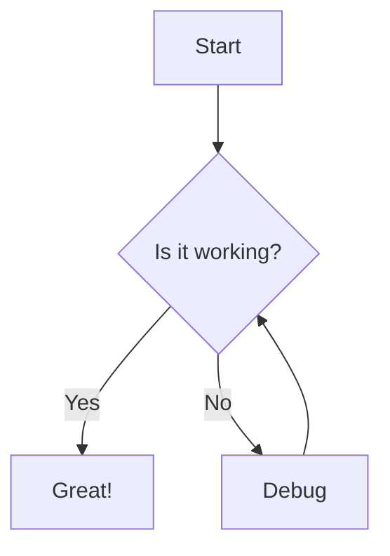

# Rich Editor Demo

Welcome to the `@haklex/rich-editor` playground. Try **markdown shortcuts**, *inline formatting*, and custom blocks below.

## Inline Features

Supports **bold**, *italic*, `inline code`, and ||hidden spoiler text||. Math: $E = mc^2$. Mention: {GH@innei}.

## Alerts

> [!NOTE]
> This is a note alert for additional context.

> [!TIP]
> Pro tip: Use 
> pnpm
>  for faster installs.

## Code Block

```typescript
function greet(name: string): string {
  return `Hello, ${name}!`
}

console.log(greet('World'))
```

## Code Snippet

::: code-snippet
::: file{name="app.tsx" lang="tsx"}
```tsx
import { useState } from 'react'

export function App() {
  const [count, setCount] = useState(0)
  return (
    <button onClick={() => setCount(c => c + 1)}>
      Count: {count}
    </button>
  )
}
```
:::
::: file{name="main.ts" lang="tsx"}
```tsx
import { createRoot } from 'react-dom/client'
import { App } from './app'

createRoot(document.getElementById('root')!).render(<App />)
```
:::
::: file{name="package.json" lang="json"}
```json
{
  "name": "my-app",
  "dependencies": {
    "react": "^19.0.0",
    "react-dom": "^19.0.0"
  }
}
```
:::
:::

## Lists & Tasks

- First item
- Second item
- Third item

- [x] Implement nodes
- [x] Add transformers
- [ ] Write unit tests

### Nested Lists

- Top-level bullet
    - Second level
        - Third level (square marker)
        - Another deep item
    - Back to second level
- Top-level bullet again

1. Ordered step one
    1. Sub-step a (lower-alpha)
    2. Sub-step b
2. Ordered step two

## Mermaid Diagram



## Blockquote & Math

> *The best code is no code at all.*


---

## Image


## Table Image Resize Repro

Reproduction fixture: resize the image in the first cell, then drag the same column.

| Image cell | Adjacent cell | Expected behavior |
| --- | --- | --- |
|  | This column should reclaim width after the image display width is reduced. | The image display width should not keep the original column width locked. |

## Video

<video src="https://interactive-examples.mdn.mozilla.net/media/cc0-videos/flower.mp4" poster="https://picsum.photos/1200/675?random=511" width=1200 height=675 controls></video>

## Collapsible

::: details{summary="Click to expand"}
Hidden content revealed on toggle.
:::

## Nested Document

<nested-doc>
Embedded Document
This is a 
nested document
 embedded within the parent document. It supports all node types.
You can include 
rich formatting
, code like 
console.log()
, and more.
Collapsed by default at 400px
Expand to see full content
In edit mode, click to open modal editor
Code Block

Table
Node
Support
Edit
Render
Nested
SSR
Note
Table
Yes
Yes
Yes
Yes
Yes
Resize, add/remove rows
Code Block
Yes
Yes
Yes
Yes
Yes
Syntax highlight
Image
Yes
Yes
Yes
Yes
Yes
Thumbhash placeholder
Mermaid
Yes
Yes
Yes
Yes
Yes
Diagram render
KaTeX
Yes
Yes
Yes
Yes
Yes
Inline & block math
Paragraph 4: Additional content to demonstrate truncation behavior.
Paragraph 5: The nested document can hold substantial content.
Paragraph 6: Readers see a preview with a gradient mask overlay.
Paragraph 7: Click the expand button to reveal everything.
Paragraph 8: The editor modal provides full editing capabilities.
Paragraph 9: Changes sync back to the parent document on save.
Paragraph 10: This line should be truncated in collapsed view.
Paragraph 11: Only visible after expanding.
Paragraph 12: Final paragraph of the nested document.
</nested-doc>

## Poll

Polls render interactively in the readonly renderer below — try voting:

<!--haklex:poll {"pollId":"p_demo_single","mode":"single"}-->
**Which cat species do you prefer?**

- Ragdoll <!-- id=o_ragdoll -->
- American Shorthair <!-- id=o_amshort -->
- Orange tabby <!-- id=o_orange -->
<!--/haklex:poll-->

<!--haklex:poll {"pollId":"p_demo_multi","mode":"multiple"}-->
**Which pets have you raised? (multi-select)**

- Cat <!-- id=o_cat -->
- Dog <!-- id=o_dog -->
- Hamster <!-- id=o_hamster -->
- Fish <!-- id=o_fish -->
<!--/haklex:poll-->

## Link Card

[Lexical - Extensible Text Editor Framework](https://lexical.dev)

[Innei/haklex - Pull Request #7](https://github.com/Innei/haklex/pull/7)

*Start editing above, or import JSON via the toolbar.*