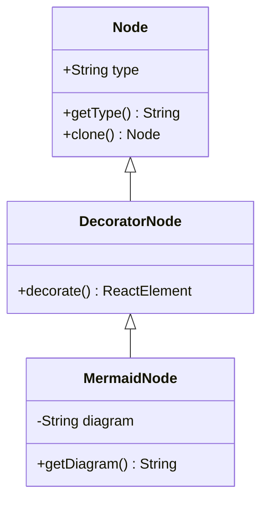

```mermaid
classDiagram
    class Node {
      +String type
      +getType() String
      +clone() Node
    }
    class DecoratorNode {
      +decorate() ReactElement
    }
    class MermaidNode {
      -String diagram
      +getDiagram() String
    }
    Node <|-- DecoratorNode
    DecoratorNode <|-- MermaidNode
```